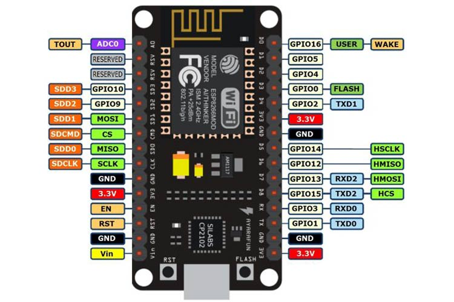
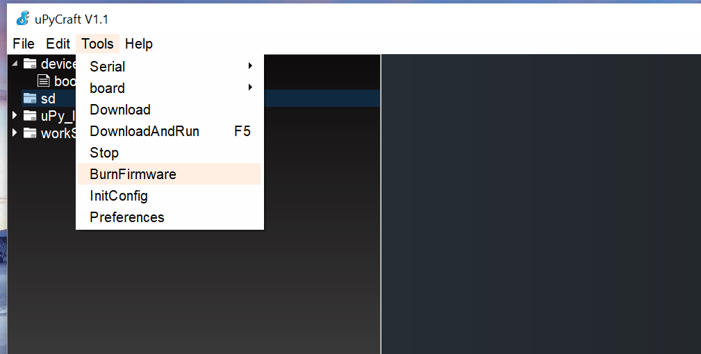
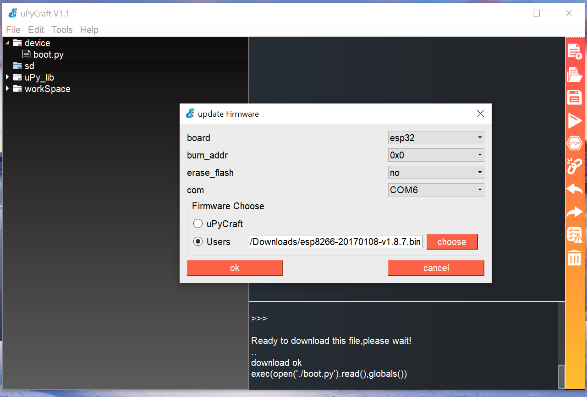
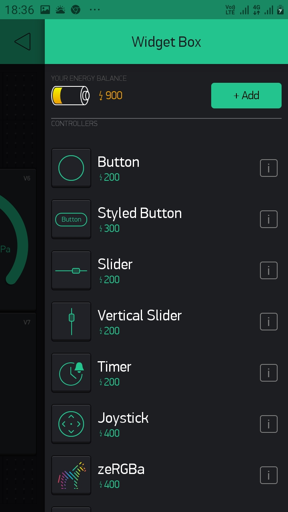
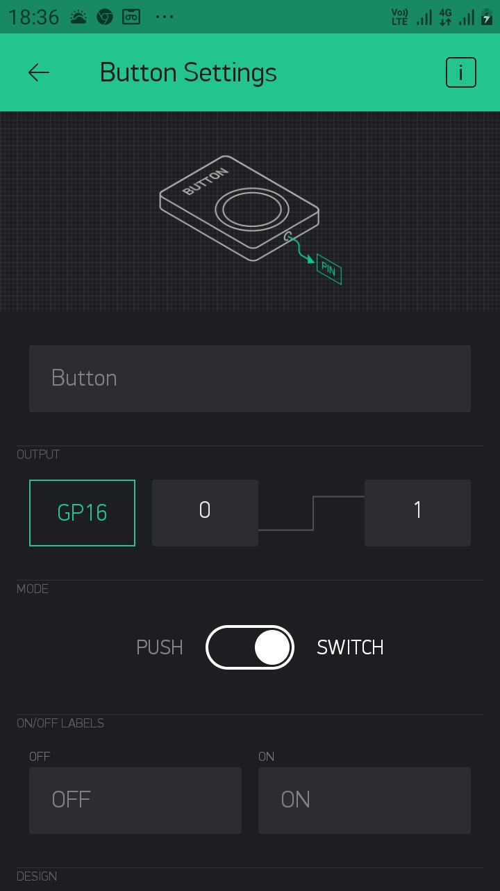
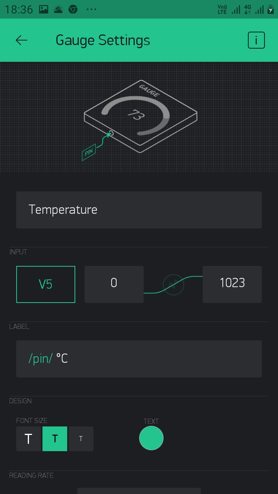
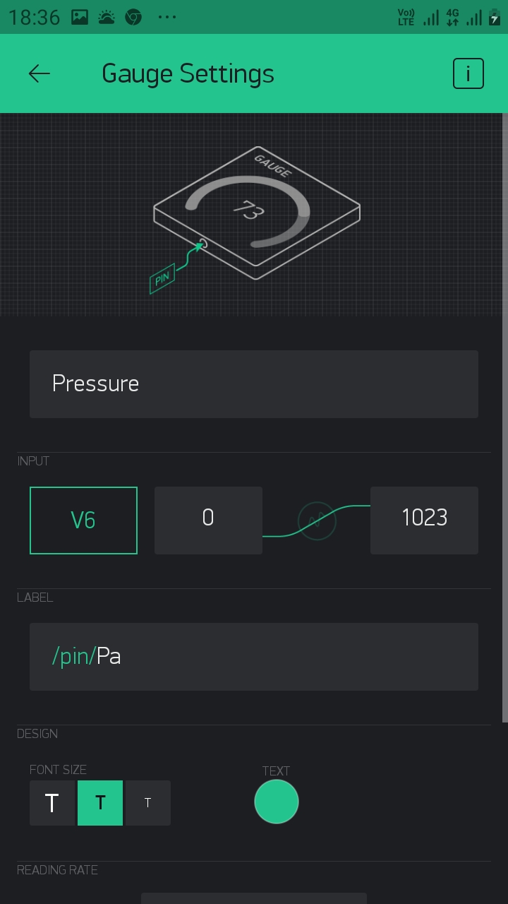
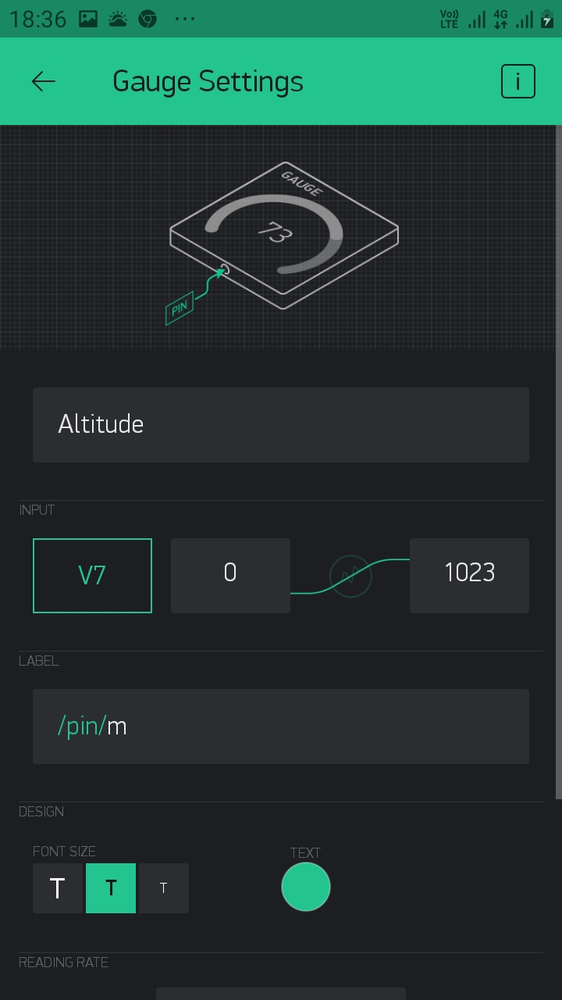
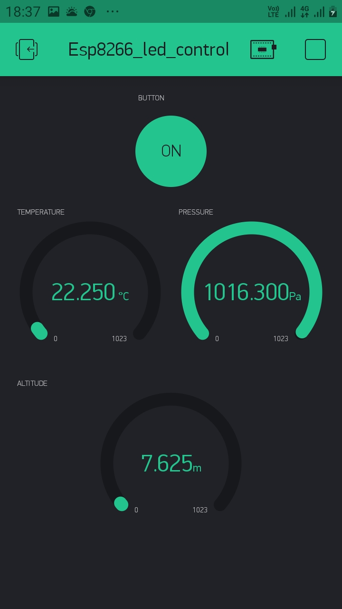

# [Micropython](https://en.wikipedia.org/wiki/MicroPython#:~:text=From%20Wikipedia,%20the%20free%20encyclopedia%20MicroPython%20is%20a,and%20runtime%20that%20runs%20on%20the%20microcontroller's%20hardware.)-in-[NodeMCUESP8266](https://en.wikipedia.org/wiki/NodeMCU)


[](https://paypal.me/baponkar?locale.x=en_GB)


----------------------------------------------------------------------------------------------
<!-- Please don't remove this: Grab your social icons from https://github.com/carlsednaoui/gitsocial -->

<!-- display the social media buttons in your README -->

[![alt text][1.1]][1]


<!-- links to social media icons -->
<!-- no need to change these -->

<!-- icons with padding -->
[1.1]: http://i.imgur.com/P3YfQoD.png (facebook icon with padding)


<!-- icons without padding -->

[1.1]: http://i.imgur.com/fep1WsG.png (facebook icon without padding)


<!-- links to your social media accounts -->
<!-- update these accordingly -->

[1]: https://www.facebook.com/bapon.kar


<!-- Please don't remove this: Grab your social icons from https://github.com/carlsednaoui/gitsocial -->


* :octocat: Version -v-1.0.0
* :octocat: License- GNU GPL V3.O

#### DESCRIPTION:
* This repository is complete description of using Micropython in esp8266 with practical example and tool setup and also discussion about many problems as well as its solutions.
* I will appreciate any kind update or suggestions.




 
 ## Step by step micropython test in esp8266
 --------------------------------------------
 ## Installing tools for Windows-10:

- [x] My System is [Windows-10](https://www.amazon.in/Windows-10-Home-OEM-Lifetime/dp/B08CN5887S/ref=sr_1_1_sspa?dchild=1&keywords=windows+10&qid=1611655557&sr=8-1-spons&psc=1&spLa=ZW5jcnlwdGVkUXVhbGlmaWVyPUEzVjRLQTlMUFo3SktZJmVuY3J5cHRlZElkPUEwNzI5OTk3MlROTVlTWktGSjFMUSZlbmNyeXB0ZWRBZElkPUEwMjA5NTI0MjVIUTRCWkNHWkoxMiZ3aWRnZXROYW1lPXNwX2F0ZiZhY3Rpb249Y2xpY2tSZWRpcmVjdCZkb05vdExvZ0NsaWNrPXRydWU=) 

- [x] Board - [NodeMCU ESP8266](https://www.amazon.in/Generic-Nodemcu-Esp8266-Internet-Development/dp/B07262H53W/ref=sr_1_2?dchild=1&keywords=esp8266&qid=1610616571&sr=8-2)

- [x] System Python version - [Python-3.7.9 ](https://www.python.org/ftp/python/3.9.1/python-3.9.1-amd64.exe)

- [x] [Micropython Firmwaire](http://micropython.org/resources/firmware/esp8266-20170108-v1.8.7.bin) or [Micropython-v1.8.7.bin](https://github.com/baponkar/micropython-in-esp8266/blob/main/esp8266-20170108-v1.8.7.bin)

- [x] [UPyCraft v1.1 IDE](https://randomnerdtutorials.com/uPyCraftWindows) or [uPyCraft v1.1 IDE](https://github.com/baponkar/micropython-in-esp8266/blob/main/uPyCraft_V1.1.exe)

* firmeware install into esp8266 board




## Installing tool for esp8266 in Ubuntu

- [x] ```sudo apt-get update```
- [x] Installing [python3](https://www.python.org/download/releases/3.0/) ``` sudo apt-get install python3```
- [x]  ``` sudo pip3 install esptool ```
- [x] Installing [esptool](https://github.com/espressif/esptool) to flash esp8266 ``` esptool.py --port /dev/ttyUSB0 erase_flash ```
- [x] installing firmware into esp8266 board``` esptool.py --port /dev/ttyUSB0 --baud 460800 write_flash --flash_size=detect 0 esp8266-20170108-v1.8.7.bin ```
- [x] To run live micropython code on the board install picocom``` picocom /dev/ttyUSB0 -b115200 ```
- [x] You need to install [ampy](https://pypi.org/project/adafruit-ampy/)``` sudo pip3 install adafruit-ampy ```
- [x] ``` ampy --help ```
- [x] see port usually last of the list be the port of esp8266: ``` ls -l /dev/tty/* ``` then run next command
- [x] Now upload blink.py micropython file into the board by following command on the terminal``` ampy --port USB0 put blink.py  ```

###### [Micropython Documentation](https://docs.micropython.org/en/latest/esp8266/tutorial/intro.html)


* [Onboard Led blink](https://github.com/baponkar/micropython-in-esp8266/blob/main/onboard_led_control.py)
* [Network Control]( https://github.com/baponkar/micropython-in-esp8266/blob/main/network_control.py)
* [Servo Control](https://github.com/baponkar/micropython-in-esp8266/blob/main/servo_control.py)
* [File Manipulation](https://github.com/baponkar/micropython-in-esp8266/blob/main/file_manipulation.py)

Sometimes you may have this kind error due to insufficient memory allocation:
```download ok
exec(open('main.py').read(),globals())
Traceback (most recent call last):
  File "<stdin>", line 1, in <module>
MemoryError: memory allocation failed, allocating 10496 bytes
```
Install micropython in [Ubuntu](https://snapcraft.io/install/micropython/ubuntu#install) by following commands:
```
sudo apt-get update
sudo apt-get install snapd
sudo snap install micropython
```

Then you need to make a custom firmwire and add [frozen module](https://learn.adafruit.com/micropython-basics-loading-modules/frozen-modules) to save memory.
Now you need to change file.py to [file.mpy](http://docs.micropython.org/en/v1.12/reference/mpyfiles.html) which generally takes lower ram than .py file to change into .mpy file .

Install [mpy-cross](https://pypi.org/project/mpy-cross/) :``` sudo pip3 install mpy-cross ```

Checking mpy-cross version ``` python3 -m mpy_cross --version```

Changing .py to .mpy file ```python3 -m mpy_cross blink.mpy -s blink.py```

you need to install following software into your Ubuntu device.If you are using widows then you need to install virtual box inside of windows and then you need to install [ubuntu](https://releases.ubuntu.com/20.04/) os(OR [another method](https://ubuntu.com/tutorials/ubuntu-on-windows#1-overview)) on that virtualbox and then you need to install following software on ubuntu. 
Installing virtualbox on Ubuntu :


```
sudo apt-get update
sudo apt install virtualbox-qt

```
Installing [Vagrant](https://linuxize.com/post/how-to-install-vagrant-on-ubuntu-20-04/) on Ubuntu:
```
sudo apt install curl
curl -O https://releases.hashicorp.com/vagrant/2.2.9/vagrant_2.2.9_x86_64.deb
sudo apt install ./vagrant_2.2.9_x86_64.deb
vagrant --version
```
Getting Started with Vagrant 
```
mkdir ~/my-vagrant-project
cd ~/my-vagrant-project

```
[Vagrant Catalog box](https://www.vagrantup.com/docs/boxes)
```
vagrant init centos/8
```
```
vagrant up
```
Now It's time to build yours own firmware for [Ubuntu](https://learn.adafruit.com/building-and-running-micropython-on-the-esp8266/build-firmware) or for [Windows -10](https://medium.com/@botdotcom/installing-virtualbox-and-vagrant-on-windows-10-2e5cbc6bd6ad#:~:text=%20Installing%20VirtualBox%20and%20Vagrant%20on%20Windows%2010,halt%20to%20shut%20it%20down.%20%20More)for esp8266 as you can able to use pre baked .mpy file as it is taking less memory and resolve the previous memory allocation  error.\

After doing all of the above staff and my final conclusion is micropython or circuitpython is not good choice for NodeMcuESP8266 module.
So I am going back into default firmware.To download [default firmware](https://www.espressif.com/en/support/download/all) and addding  
## Setup the Arduino IDE
* Download Arduino IDE.
* Open your IDE and click on File -> Preferences".
* In “Aditional Boards Manager URLs” add this line and click on “OK”:
-[x] http://arduino.esp8266.com/stable/package_esp8266com_index.json
* Go to “Tools -> Board -> Boards Manager”, type “ESP8266” and install it.

* Go again to “Tools -> Board” and select “Generic ESP8266 Module”.

* [Network](https://www.electronicshub.org/connect-esp8266-to-wifi/) control

* [Control a LED attached on D1 Pin by Alexa](https://github.com/baponkar/micropython-in-esp8266/blob/main/led_control_by_alexa.ino)
  * You need following libraries : 
   * [ESPAlexa](https://github.com/Aircoookie/Espalexa)
* [Getting BMP280 Sensor Temperature,Pressure and altitude](http://www.esp8266learning.com/esp8266-bmp280-sensor-example.php)
  * You need following libraries:
   * Get I2C address  by [i2cscaner](https://github.com/baponkar/micropython-in-esp8266/blob/main/i2c_scanner.ino) of esp8266 to fill the ic2 address
   * [AdafruitBMP280](https://github.com/adafruit/Adafruit_BMP280_Library)
 * [Web Controled LED](https://github.com/baponkar/micropython-in-esp8266/blob/main/web_controled_led)
* [BMP280 sensor data show in blynk](https://github.com/baponkar/micropython-in-esp8266/tree/main)
 * You need following libraries
   *
  * [Blynk](https://blynk.io/) app making
   * 
   * 
   * 
   * 
   * 
   * 
   * [Adding time display in blynk app in above program](https://github.com/baponkar/micropython-in-esp8266/blob/main/bmp280_sensor_data_shown_in_blynk_with_time_display.ino)
     * You also need [time](https://github.com/PaulStoffregen/Time) library
     

